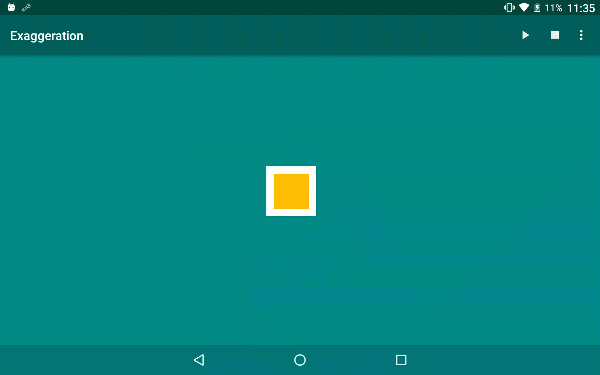
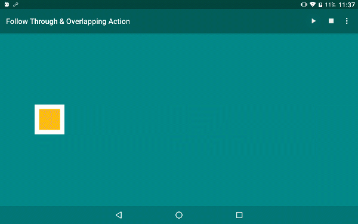
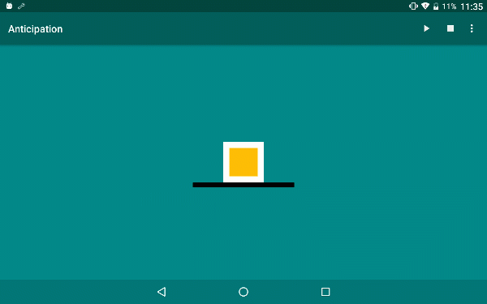
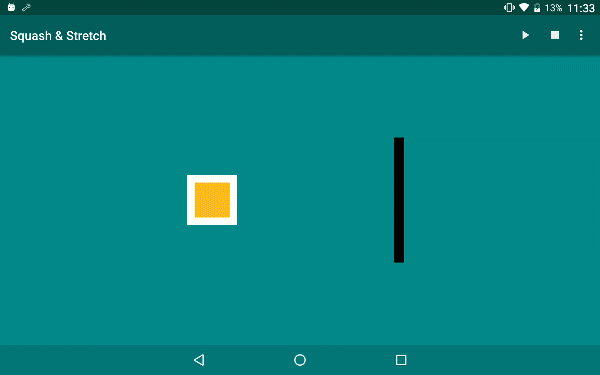
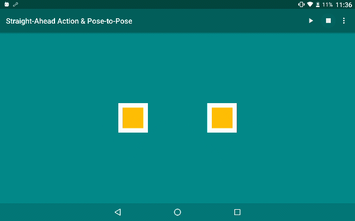
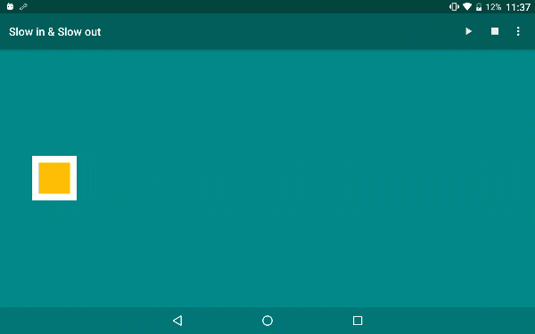
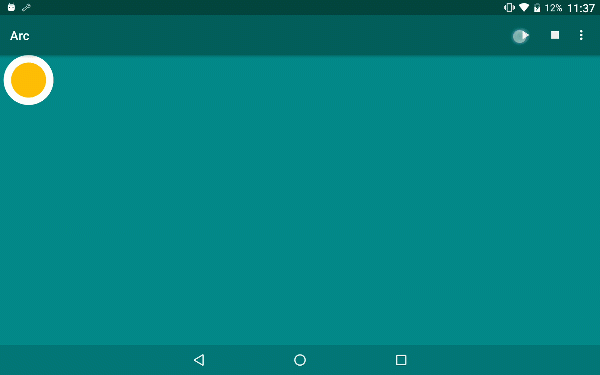
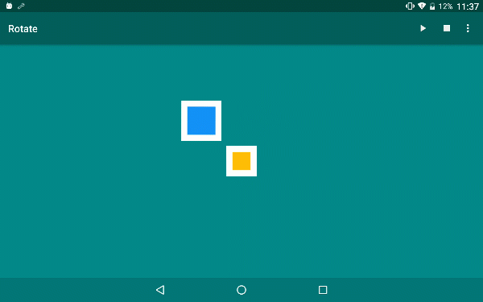
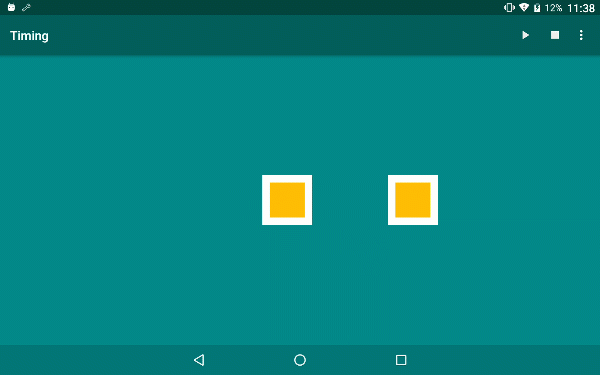

# Disney's Twelve Basic Principles of Animation on Android

This project demonstrates [12 basic principles of animation](https://en.wikipedia.org/wiki/12_basic_principles_of_animation)  on Android platform. 

 - Inspired by [Animation Principles for the Web](https://cssanimation.rocks/principles/)
 - All animations in this project are written & implemented with [Android Property Animation](https://developer.android.com/guide/topics/graphics/prop-animation.html)
 APIs.

Download the APK file [animation-principles-v0.9.1-release.apk](https://github.com/vhow/animation/releases/download/v0.9.1/animation-principles-v0.9.1-release.apk)

## Exaggeration

## Follow Through and Overlapping Action

## Anticipation

## Squash and stretch

## Staging

## Straight Ahead Action and Pose to Pose

## Ease In and Ease Out

## Arc

## Timing

